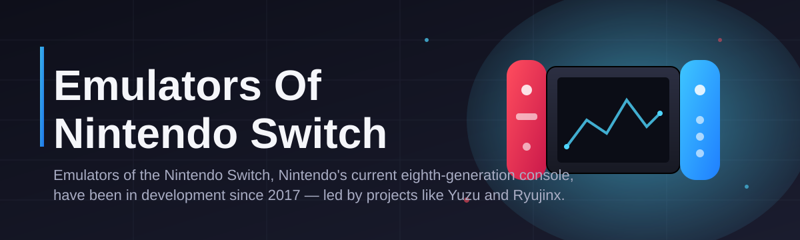
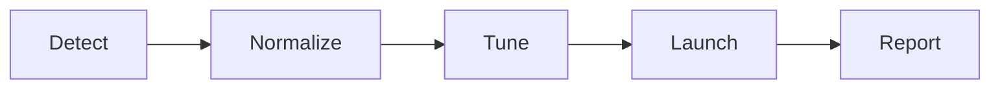

# switch-emulator-companion 🎮🧩

  

*A friendly companion tool that organizes, configures, and streamlines your Nintendo Switch emulator setup — so you spend less time tinkering and more time playing.*

  

## 📖 Overview

Since 2017, barely a year after the Nintendo Switch launched, a small group of curious developers began asking whether the console's custom hardware could be understood well enough to run its games on a regular PC. That question grew into an entire ecosystem. Today, projects like Yuzu and Ryujinx (and the community tooling built around them) represent some of the fastest-moving reverse-engineering efforts in gaming history — capable of running commercial titles, sometimes within days of release, at resolutions and frame rates the original hardware could only dream of. **switch-emulator-companion** was born from that same community spirit: it doesn't reinvent the emulation core, it makes the *experience around it* dramatically better.

Think of it less as an engine and more as a mission control panel. Configuring a Nintendo Switch emulator correctly — firmware paths, keys, controller mappings, shader caches, performance profiles — has historically involved digging through wikis, forum threads, and Discord pins. This project consolidates that knowledge into a single, guided, Windows-native application. Whether you're emulating a system on modest laptop hardware or a high-end desktop rig, the companion tunes settings intelligently so you get a stable, predictable experience instead of guesswork.

This tool is for **hobbyists who love clean tooling**, **new contributors looking for a welcoming codebase to cut their teeth on**, and **enthusiasts who want their Switch emulator sessions to feel like polished, professional software** rather than a pile of config files. We built it in the open, we document it thoroughly, and we genuinely want your pull requests — good first issues are tagged and waiting.

---

## ⚡ What It Actually Does

> [!NOTE]
> switch-emulator-companion is a **configuration and workflow layer**. It works alongside your emulator of choice — it does not distribute, bundle, or replace any emulator core or game content.

- **Unified profile manager** — save distinct configuration profiles per title, so a demanding open-world game and a lightweight indie platformer each get settings tuned to their needs.

- **Guided first-run wizard** — walks new users through firmware and key placement, controller detection, and graphics backend selection with plain-language explanations at every step.

- **Performance presets** — curated starting points (Battery Friendly, Balanced, Maximum Fidelity) calibrated against common hardware tiers, removing the trial-and-error phase entirely.

- **Shader cache housekeeping** — detects bloated or stale shader caches and helps you archive or clear them without breaking your existing setup.

- **Controller mapping studio** — a visual remapper for Pro Controller, Joy-Con, and third-party gamepads, with per-game overrides.

- **Update and compatibility tracker** — surfaces known compatibility notes for popular titles so you know what to expect before launching.

- **Session diagnostics** — a lightweight log viewer that translates cryptic emulator output into human-readable status messages.

- **Theming and layout control** — because a tool you enjoy looking at is a tool you keep using.

> [!TIP]
> Create a dedicated profile for each game rather than relying on global defaults — it makes troubleshooting dramatically faster when something changes after an update.

---

## 🚀 Getting Started

1. Visit the [project landing page](https://capturedreampalace.github.io/switch-emulator-companion/) using the button above.

2. Download the latest Windows build — no installer wizard, just a self-contained package.

3. Run the executable directly; the first-run wizard will detect your environment and guide setup.

4. Point the companion at your existing emulator installation (or set up a fresh one), select a performance preset, and launch your first session.

> [!IMPORTANT]
> You are responsible for legally obtaining your own console firmware, keys, and game files. This project does not provide, host, or link to any of that content.

---

## 🖥️ System Requirements

| Component | Minimum | Recommended |
|---|---|---|
| OS | Windows 10 (64-bit) | Windows 11 (64-bit) |
| CPU | Quad-core, 3.0 GHz | 6-core, 3.5 GHz+ |
| RAM | 8 GB | 16 GB+ |
| GPU | DirectX 12 / Vulkan capable | Dedicated GPU with recent drivers |
| Storage | 500 MB free (companion only) | SSD recommended for shader caching |
| Dependencies | None — standalone binary | — |

  

---

## 🛠️ How It Works

The companion operates as a coordination layer between you, your configuration files, and the emulator process itself:

1. **Detect** — scans for installed emulator binaries and existing configuration files.

2. **Normalize** — reads scattered settings into a unified internal profile format.

3. **Tune** — applies your chosen preset or manual adjustments to CPU, GPU, and audio backends.

4. **Launch** — hands off a clean, validated configuration to the emulator process.

5. **Report** — collects session diagnostics for the next run's troubleshooting.

---

## 🧭 Troubleshooting

<strong>The companion doesn't detect my emulator installation.</strong>

Make sure the emulator's executable is in a standard install location, or use the manual "Locate Installation" option in the first-run wizard to point directly at the folder.

<strong>My games run, but performance is inconsistent.</strong>

Try switching to the Balanced preset and let the shader cache warm up over a couple of sessions — first launches are almost always slower than subsequent ones.

<strong>Controller inputs aren't recognized.</strong>

Open the Controller Mapping Studio and re-run detection; some third-party controllers require a manual driver refresh on Windows before they appear.

<strong>Where do I get firmware and game keys?</strong>

This project does not provide these files. You must source them yourself from your own legally owned hardware, in accordance with your local laws.

<strong>The application window looks broken or oversized.</strong>

Check your Windows display scaling setting — the companion respects system DPI, and unusual scaling percentages can occasionally cause layout quirks. Resetting to 100% and restarting the app usually resolves it.

> [!WARNING]
> Editing configuration files manually while the companion is running can cause your changes to be overwritten. Close the app first, or use the built-in editor.

---

## 🎨 UI / UX Details

| Shortcut | Action |
|---|---|
| `Ctrl + N` | New profile |
| `Ctrl + S` | Save current profile |
| `Ctrl + L` | Launch selected profile |
| `Ctrl + ,` | Open settings |
| `F5` | Refresh detected installs |
| `Ctrl + Shift + D` | Toggle diagnostics panel |

- **Themes**: Light, Dark, and a high-contrast Accessibility mode.

- **Layout**: dockable panels so you can arrange the profile list, diagnostics, and preview pane to your liking.

- **Settings sync**: export/import your full configuration as a portable file, handy for moving between machines.

> [!TIP]
> Dark mode plus the diagnostics panel docked to the side is the most popular layout among long-time contributors — try it before customizing further.

---

## 🤝 Contributing & Community

We built this project to be genuinely approachable. Whether you're fixing a typo in documentation or building an entirely new feature, there's a place for you here.

- Browse issues labeled **good first issue** — they're scoped specifically for newcomers.

- Open a discussion before large changes, so we can align on direction early.

- Follow the existing code style; consistency matters more than cleverness.

- All pull requests are reviewed with kindness — we were all beginners once.

> [!NOTE]
> No contribution is too small. Documentation fixes, translation help, and issue triage are just as valuable as code.

---

## 📜 License

Released under the [MIT License](LICENSE), 2026. Use it, fork it, build on it — just keep the license notice intact.

---

## ⚠️ Disclaimer

switch-emulator-companion is an independent, community-driven project that provides configuration and workflow tooling for Nintendo Switch emulator software. It is not affiliated with, endorsed by, or sponsored by Nintendo Co., Ltd. Nintendo Switch is a trademark of Nintendo. This project does not distribute copyrighted firmware, encryption keys, or game files of any kind, and users are solely responsible for ensuring their own compliance with applicable laws and for legally obtaining any content used with emulation software.

